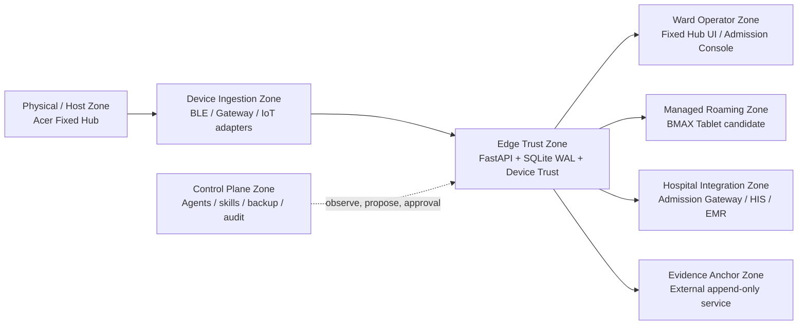

# Smart Ward Hub — Zero-Trust Security Trust Boundaries

**สถานะ:** Architecture design and validation contract  
**Current evidence:** P0-hardened software baseline; real IdP, PKI, host, network and hospital validation pending

## 1. Design objective

Smart Ward Hub must treat every device, user, service, tablet, gateway and external destination as **untrusted until the request is authenticated, authorized, scoped, fresh enough, and consistent with the current Fixed Hub state**. Network location, NFC presence, a valid-looking payload, a cached tablet snapshot or a previous successful request must not create implicit trust.

The design adds Zero-Trust structure around the existing Edge-first and Zero-PII architecture. It does not turn the control plane into a clinical authority and does not claim regulatory compliance by architecture alone.

## 2. Trust zones

The arrows represent explicit, authenticated data flows, not network trust. The dashed control-plane relationship is intentionally non-clinical: agents may inspect, coordinate, verify and propose, but they may not become a second source of patient truth or autonomously alter clinical state.

## 3. Boundary catalogue

| Boundary | Assets crossing | Identity required | Authorization | Required verification | Fail-closed behavior |
|---|---|---|---|---|---|
| Z0 Physical/host → service | booted service, database path, checkpoint, certificates | OS service account, disk/host policy | local filesystem least privilege | encrypted volume, patch state, time, service binding, file permissions | do not start pilot service if prerequisites are missing |
| Z1 Device/Gateway → ingestion | device ID, key ID, signed TelemetryPacket v1, sequence, sensor values | device public key / gateway identity; Ed25519 baseline | telemetry write only | signature, canonical packet, clock skew, sequence/replay, enrollment/lifecycle | reject packet or enter observe/audit path; never silently accept as trusted |
| Z2 Ingestion → Edge core | validated telemetry and derived event | in-process boundary plus authenticated service identity for future split | minimum internal capability | schema, pairing/session, device trust and rate limit | reject/quarantine; preserve monitoring continuity where safe |
| Z3 Edge core → operator UI | bed/session state, alert state, freshness, operational metrics | operator OIDC identity; development static token only | scope-based read/write; separation of duties | token issuer/audience/expiry, scope, request ID, audit | 401/403/503; no anonymous fallback |
| Z4 Edge core → Admission Console | non-PII bed availability, reservation/task state | operator OIDC + managed console identity | admission read/write only | opaque token contract, idempotency, reservation revision/expiry | reject raw HN/AN and stale mutation |
| Z5 Edge core → Roaming Tablet | non-PII snapshot, cursor/revision, freshness, allowed command result | managed tablet identity plus user OIDC; app attestation planned | roaming read/write only; no reset confirm/purge | source identity, token freshness, expected revision, command idempotency | return stale/offline/conflict; no blind retry or destructive action |
| Z6 Admission Gateway → Edge core | opaque patient/encounter token, admission contract | mTLS client cert + OIDC service identity | admission preparation/commit only | issuer, audience, token TTL, revocation, contract version, idempotency | reject raw identity, expired token or unknown contract |
| Z7 Edge core → HIS/EMR | FHIR Bundle, minimized references, sync metadata | mTLS server/client chain + OIDC service identity | handover sync only | certificate chain/expiry/revocation, issuer/audience, profile/version, matching acknowledgement | retain local aggregates; dead-letter auth/validation failures |
| Z8 Edge core → evidence anchor | digest, signature, trusted time and chain metadata | dedicated outbound service identity / key custody | append-only evidence write/verify only | destination allowlist, payload minimization, independent verification | retain local evidence; mark external anchor unverified |
| Z9 Control plane → operations | status, manifests, audit summaries, approvals | operator/approver identity; agent identity | read/redacted evidence, proposed changes | approval, correlation ID, evidence freshness, rollback path | no apply/restore/export/rotate/delete |
| Z10 Backup/restore → data | database, WAL/checkpoint, manifests and config templates | backup service identity and encrypted destination | backup/restore role only | checksum, manifest, isolated restore, retention | keep previous known-good backup; block destructive retention action |

## 4. Identity model

| Actor | Primary identity | Scope model | Key/custody state |
|---|---|---|---|
| Registered device | `device_id` + `key_id` + public key | signed telemetry write only | software enrollment baseline; manufacturer CA/secure element pending |
| BLE/IoT gateway | gateway identity plus device provenance metadata | ingestion proxy only | must not impersonate unregistered device; proxy signing contract required |
| Ward operator | OIDC subject and approved role claims | pairing, telemetry read, admission, roaming or handover scopes | real IdP/role mapping pending; static token is development only |
| Fixed Hub service | host/service account and deployment identity | local persistence, internal processing, approved egress | host hardening and secret custody pending |
| Admission Gateway | mTLS client certificate + OIDC service identity | admission preparation/commit | CA, issuer, rotation and revocation pending |
| HIS/EMR | mTLS server identity + OIDC audience/issuer | handover sync/acknowledgement | hospital PKI and integration test pending |
| Roaming Tablet | managed device identity + operator OIDC | snapshot and safe command scopes | MDM/app attestation/encrypted cache pending |
| Evidence anchor | dedicated write-only service identity | digest/anchor operations | external WORM and key custody pending |
| Control-plane agent | named skill/runner identity and approved operator | read/propose/evidence only by default | must not receive clinical or raw identity authority |

## 5. Request decision algorithm

Every request crossing an application boundary must be evaluated in this order:

1. Identify the actor, device, service and request correlation ID.
2. Verify transport protection and endpoint allowlist for the zone.
3. Verify authentication, issuer/audience, certificate status or device signature as applicable.
4. Verify token freshness, clock skew, credential lifecycle state and request replay/idempotency key.
5. Verify scope and resource ownership; do not infer authority from network location, NFC or cached state.
6. Validate schema, data minimization and the current Fixed Hub revision/session state.
7. Apply rate limit and anomaly controls.
8. Commit the smallest allowed state transition atomically.
9. Record a redacted audit event with actor class, action, target, result, request ID and evidence reference.
10. Return a bounded response that does not disclose secrets, identity mapping or unnecessary internal detail.

## 6. Zero-Trust rules for high-risk actions

| Action | Additional gate |
|---|---|
| Pairing or admission commit | authenticated operator, deliberate bed context, opaque token, active device/session checks and audit |
| Reset/session close | `RESET_PENDING`, Fixed Hub confirmation, incident-freeze check and routine digest or forensic package |
| Hot-swap/discharge | correct session state, opaque handover ID, forensic linkage and operator confirmation |
| Device credential change | security role, reason, current credential evidence, rotation/revocation record and rollback |
| FHIR purge | exact bundle/device/time-window match, validated acknowledgement body, idempotency and retained manifest |
| Tablet command | managed identity, live Hub acknowledgement, expected revision, command ID and idempotency; no `RESET_CONFIRM` in initial pilot |
| Backup restore | approved incident/recovery reason, known-good checksum, isolated target, restore transcript and post-restore verification |
| External export | allowlisted destination, minimized/redacted payload, approval, encryption and audit event |

## 7. Data minimization rules

The Edge may use opaque `patient_token` or `encounter_token` only as a reference required by the ward workflow. The identity mapping remains with HIS or the authorized Admission Gateway. Control-plane artifacts must use service IDs, ward codes, key IDs and public-key fingerprints rather than raw patient or credential values.

Do not put raw HN/AN, patient names, national IDs, free-text clinical notes, bearer tokens, JWTs, private keys, raw telemetry windows or unredacted audit events into AI memory, Git, skill files, evidence registers, tablet cache or external anchor payloads.

## 8. Segmentation and egress

The initial deployment should separate the protected Edge service, operator/Admission Console, device/gateway network, roaming Wi-Fi and hospital integration egress. A CORS setting or an internal IP address is not a security boundary. Every egress destination must be allowlisted and authenticated; DNS, proxy, certificate and route changes require evidence and approval.

The Admission Console should remain loopback-only until an authenticated UI gateway and separate maintenance boundary are implemented. The roaming tablet must not call HIS/EMR directly. The Edge Hub should be the only component allowed to submit the authoritative handover or forensic payload.

## 9. Current state versus validation gates

| Control | Current status | Gap |
|---|---|---|
| Scope-based bearer authorization | Implemented software baseline | Real operator identity and role mapping pending |
| Fail-closed OIDC configuration | Implemented software test | Real issuer/JWKS, rotation and revocation pending |
| mTLS launcher | Implemented configuration baseline | Hospital PKI, renewal/revocation and network segmentation pending |
| Device signed telemetry | Implemented software baseline | Manufacturer provenance, secure hardware and proxy attestation pending |
| Revision/idempotency for roaming | Implemented software baseline | Managed Android identity, encrypted cache and Wi-Fi behavior pending |
| Zero-PII schema/audit redaction | Implemented software baseline | Host/downstream and external payload review pending |
| Local forensic hash chain | Implemented tamper-evident baseline | Independent append-only/WORM anchor pending |
| Host and disk hardening | Planned | Acer bench and OS evidence required |
| Backup/restore | Procedure and software checkpoints exist | Encrypted destination and real isolated restore required |

## 10. Design conclusion

Zero-Trust for Smart Ward Hub is not a single product feature. It is a chain of per-request identity, least privilege, freshness/replay protection, data minimization, state-aware authorization, explicit approval, segmentation, audit and recovery. The design is ready to guide P0 implementation, but real IdP/PKI, host, network, hardware, key custody and hospital evidence remain external validation gates.
